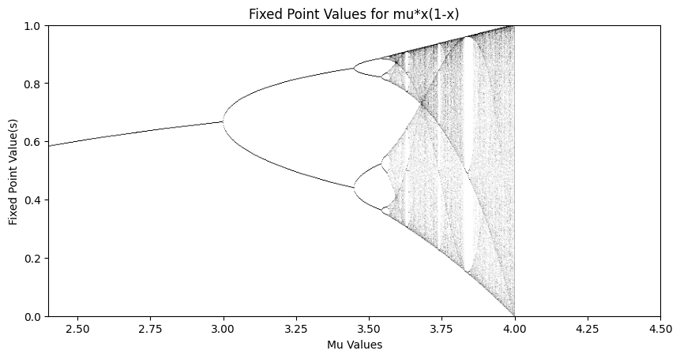

# Logistic Maps and Chaos Theory

This project explores how a simple nonlinear equation — the **logistic map** — can generate complex, chaotic behavior.  
It reproduces the **bifurcation diagram**, illustrating the transition from stability to chaos through period-doubling.

---

## Overview

The logistic map is defined as:

$$x_{n+1} = \mu x_n (1 - x_n)$$

where \( 0 < x_n < 1 \) and \( \mu \) is a control parameter representing the growth rate.

We simulate this map for \( 2.4 \le \mu \le 4.0 \) and visualize the long-term dynamics.  
The results confirm the theoretical period-doubling route to chaos originally described by May (1976).

---

## Included Files

| File | Description |
|------|--------------|
| **`logistic_map_analysis.ipynb`** | Jupyter/Colab notebook that generates the bifurcation diagram. |
| **`Logistic_Maps.pdf`** | Full paper discussing background, implementation, and results. |
| **`images/bifurcation_diagram.png`** | Visualization of the bifurcation pattern. |
| **`requirements.txt`** | List of required Python libraries (`numpy`, `matplotlib`). |

---

## Visualization



The plot shows how the system evolves as μ increases — from a single stable point to oscillations, then full chaos.

---

## ⚙️ Setup

Install dependencies:
```bash
pip install -r requirements.txt
